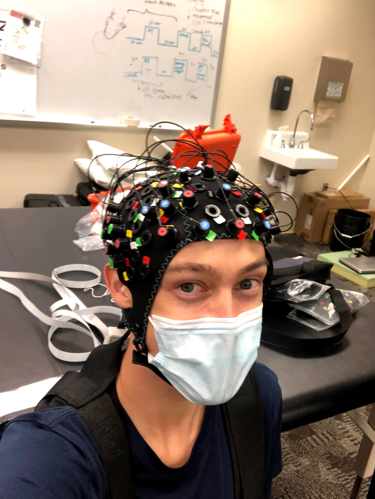
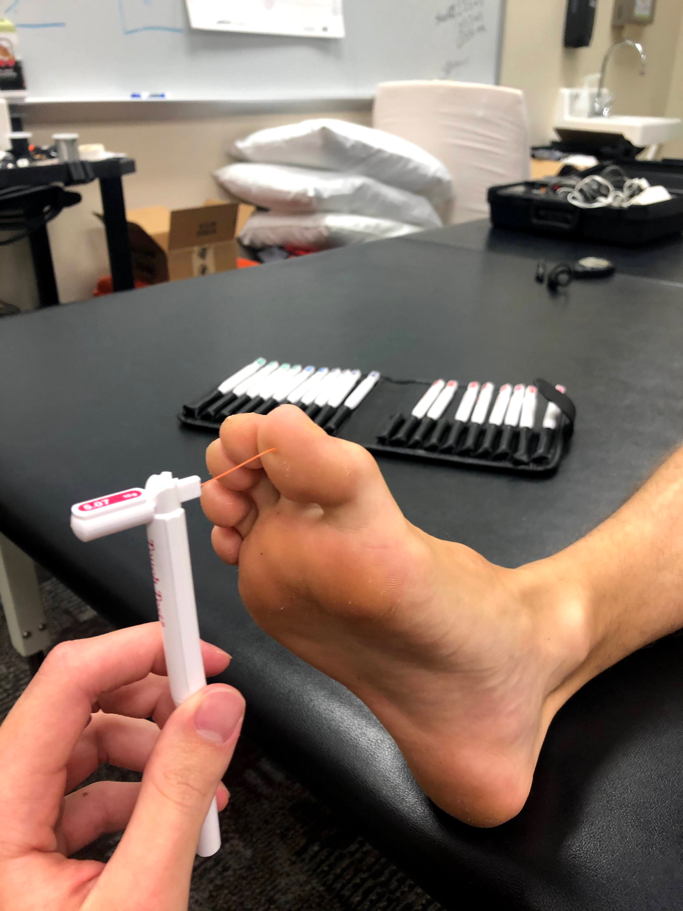
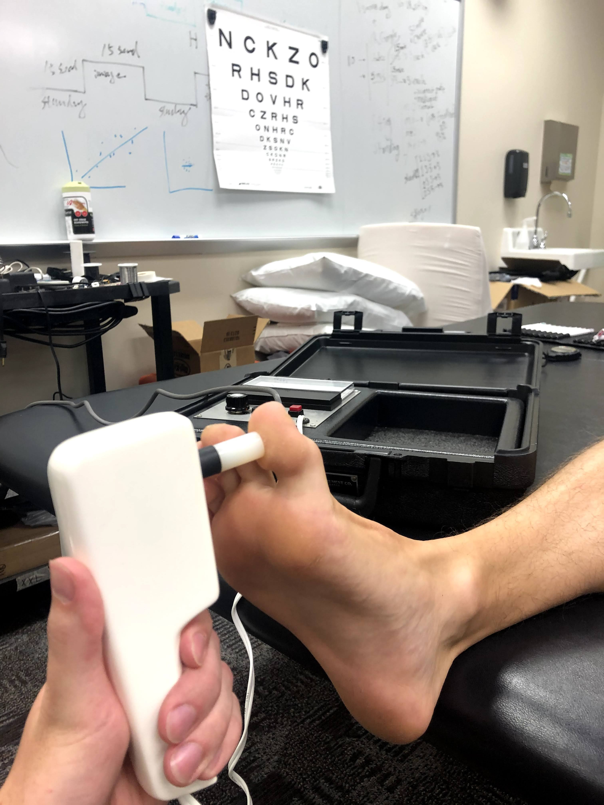

## FaSST Project

[//]: # ()

During my graduate program at East Carolina University, I had the opportunity to work in the [Sensorimotor Testing and Rehabilitation (STAR) Lab](https://sites.ecu.edu/hmal/sensorimotor-testing-and-rehabilitation-lab/) as a graduate research assistant. The STAR Lab conducts clinical research in the Department of Physical Therapy at ECU. 

I led the Fall Specific Somatosensation Threshold (FaSST Project) under the guidance of Dr. Chia-Cheng Lin and Dr. Stacey Meardon. I trained and coordinated a team of three physical therapy students and four undergraduate students. I was responsible for participant recruitment, data collection, and database management for the FaSST Project. I created documentation for training and for reference during data collection and database management. In addition to my [ASB 2020 Conference Abstract](/ASB_2020), my work on the FaSST project also contributed to two conference papers, [“Musculoskeletal Injury and Postural Control across the lifespan”](https://apta.confex.com/apta/csm2022/meetingapp.cgi/Paper/33991) and [“Identify Fall-Specific Somatosensory Thresholds (FaSST) for Improving STEADI Fall Risk Screening Algorithm – Preliminary Data Analysis”](/pdf/FaSST_CSM2021.pdf).

 

>Somatosensation threshold testing, featuring my foot.
