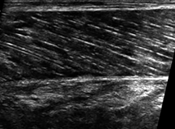
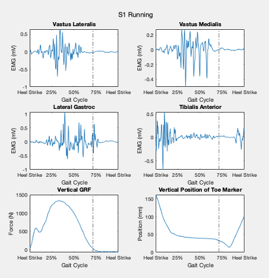

## KINE 7204: Research Techniques in Biomechanics

During my graduate program at East Carolina University, I learned to work with several biomechanical data collection tools and software in KINE 7204: Research Techniques in Biomechanics. This class introduced a new tool each week, including instrumented force platform, 3D motion capture, and electromyography. During the course, I worked with project teams planning experimental protocol, collecting data, processing the data using different software, analyzing our findings, and presenting in a lab report each week.

>For this project, I used ImageJ and Canny Edge Detector to detect aponeurosis in b-mode musculoskeletal ultrasound images.

---

>In this example, my project team conducted temporal analysis of muscle activation throughout the gait cycle using Qualysis and Matlab.

---
