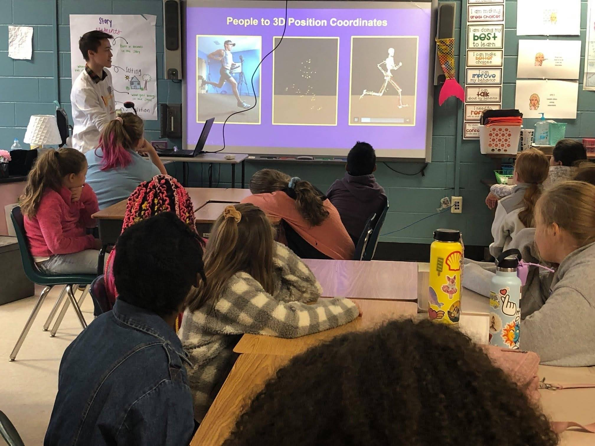
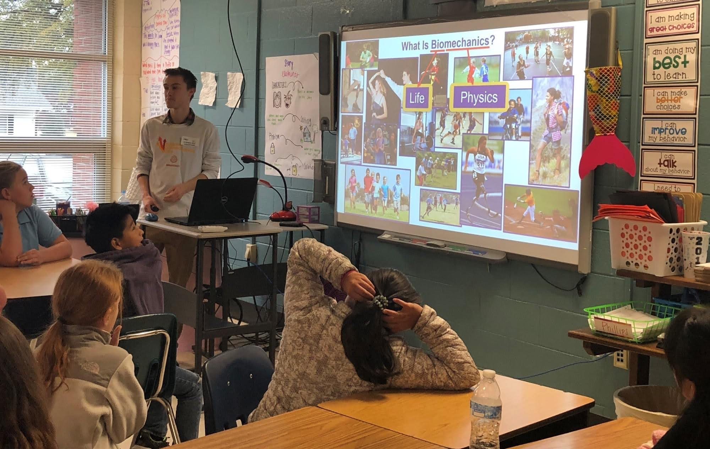

## National Biomechanics Day 2020

---

I had the opportunity to share a fun biomechanics presentation to several classrooms of 4th graders during an early National Biomechanics Day 2020. The demonstration included many fun applications of biomechanics (such as [prosthetic paws for dogs!](https://news.ecu.edu/2012/03/02/best-foot-forward/)). To get every kid an opportunity for hands-on involvement with biomechanics, everyone had a turn on a contact mat which measured jump height. It was a great experience talking with kids about Biomechanics to promote this exciting and growing branch of science. National Biomechanics Day is an awesome campaign encouraging biomechanists to share the love for biomechanics with young people all around the world, check out [The Biomechanics Initiative](https://thebiomechanicsinitiative.org).

---

