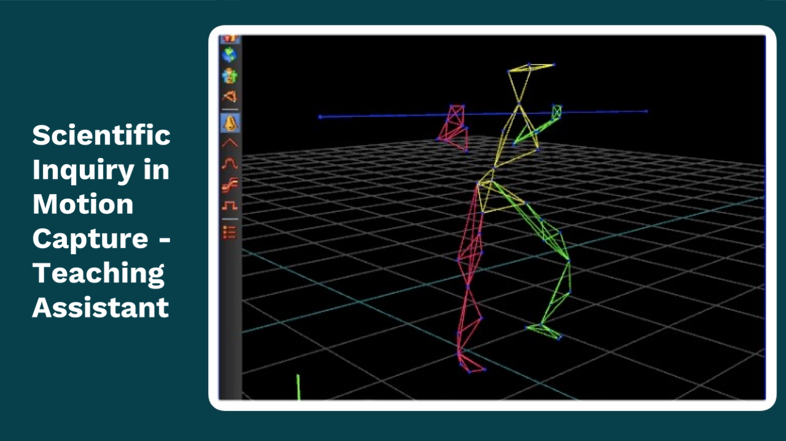

## Projects

---
[//]: # (### Projects)
[//]: # ([ASB 2020 Poster]&#40;/3D_Anthropometry.md&#41;)
[//]: # ()
[//]: # (---)

[//]: # ([]&#40;/404.md&#41;)

[//]: # (### More Projects)

[//]: # ()
[//]: # (- [Project 1 Title]&#40;http://example.com/&#41;)

[//]: # (- [Project 2 Title]&#40;http://example.com/&#41;)

[//]: # (- [Project 3 Title]&#40;http://example.com/&#41;)

[//]: # (- [Project 4 Title]&#40;http://example.com/&#41;)

[//]: # (- [Project 5 Title]&#40;http://example.com/&#41;)

---

[//]: # (---)

[//]: # (
Page template forked from <a href="https://github.com/evanca/quick-portfolio">evanca</a>
)

[//]: # (<!-- Remove above link if you don't want to attibute -->)
