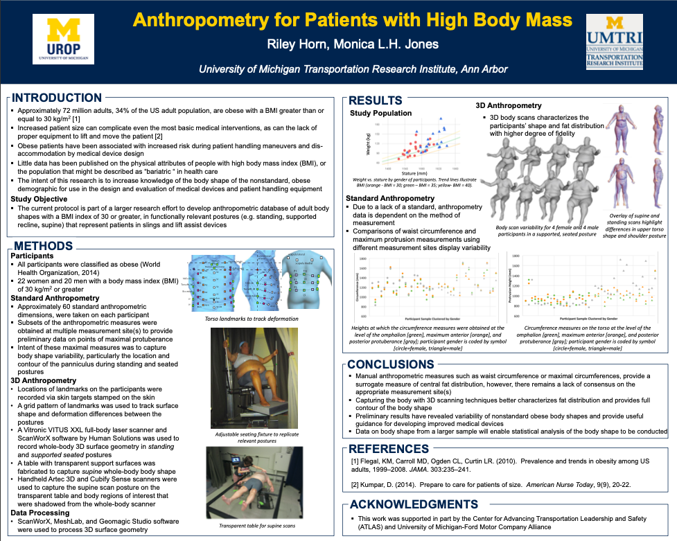

## Portfolio

---

### Projects

[ASB 2020 Poster](/3D_Anthropometry.md)

---
[ASB 2020 Poster](/3D_Anthropometry.md)

---
[UROP 2016 Poster](/UROP_Poster)

---
[UROP 2016 Poster](/UROP_Poster)

---
[Project 3 Title](http://example.com/)

---
[Project 4 Title](http://example.com/)

---
[Project 5 Title](http://example.com/)

---

### Category Name 2

- [Project 1 Title](http://example.com/)
- [Project 2 Title](http://example.com/)
- [Project 3 Title](http://example.com/)
- [Project 4 Title](http://example.com/)
- [Project 5 Title](http://example.com/)

---

[//]: # (---)

[//]: # (
Page template forked from <a href="https://github.com/evanca/quick-portfolio">evanca</a>
)

[//]: # (<!-- Remove above link if you don't want to attibute -->)
