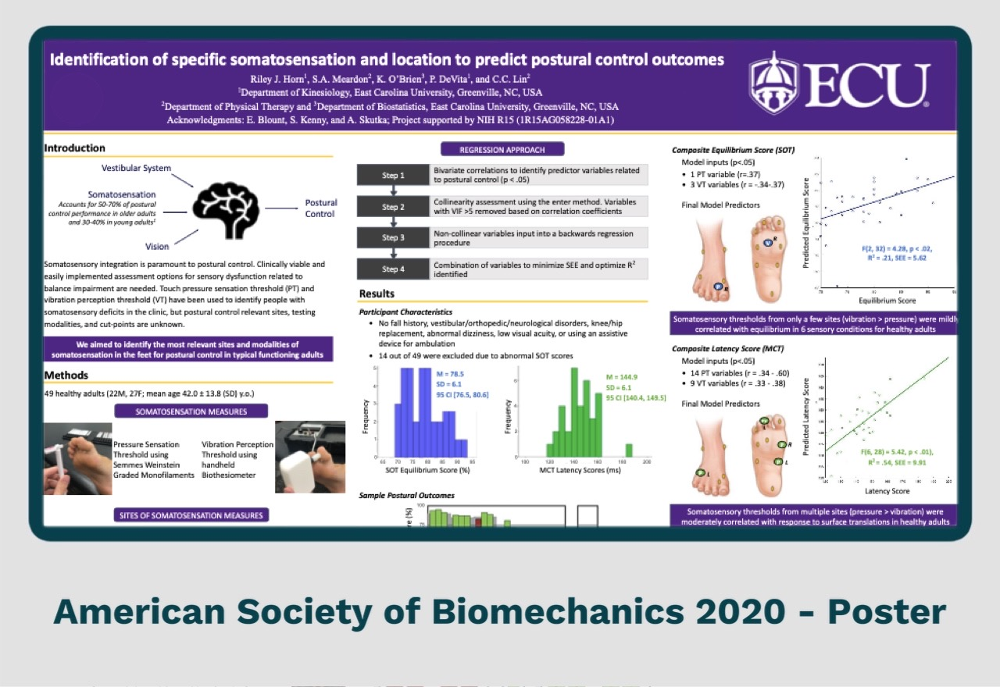
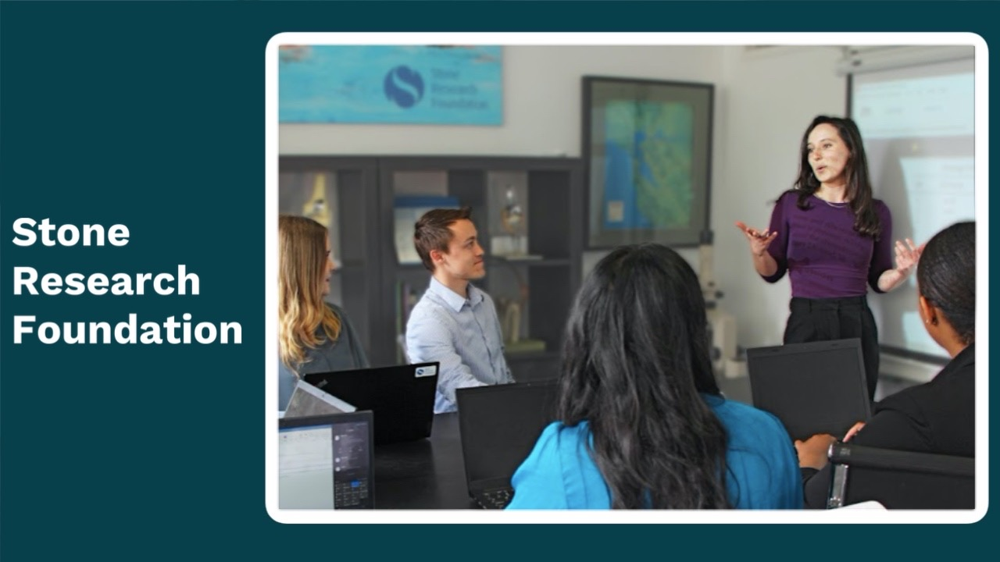
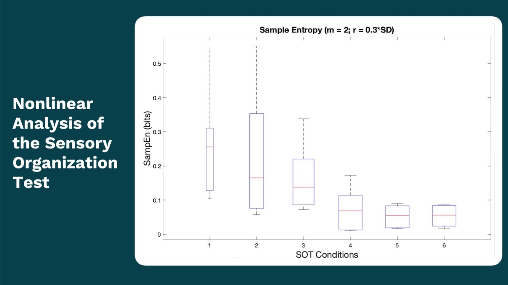
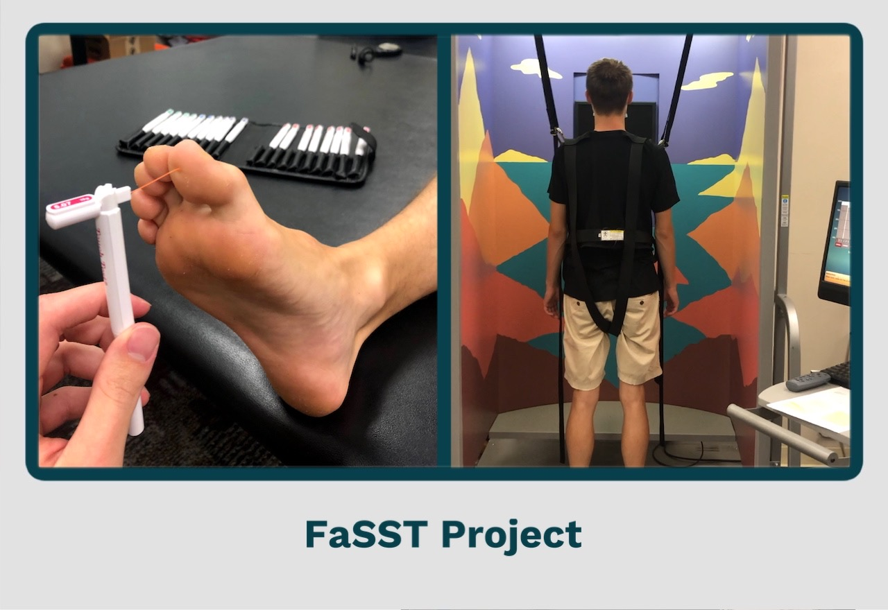
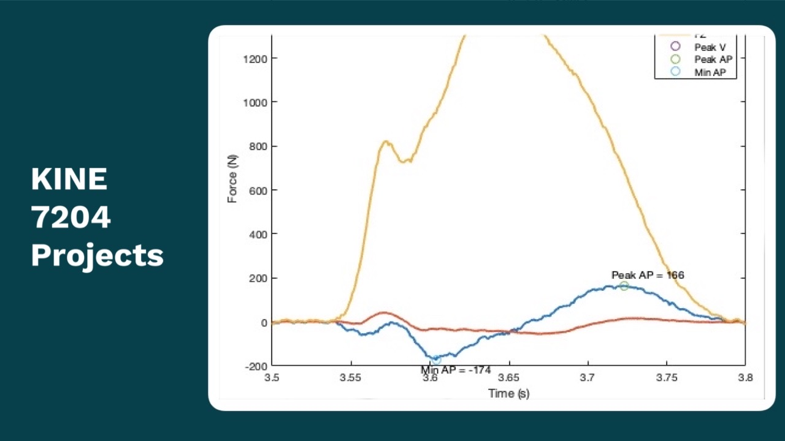
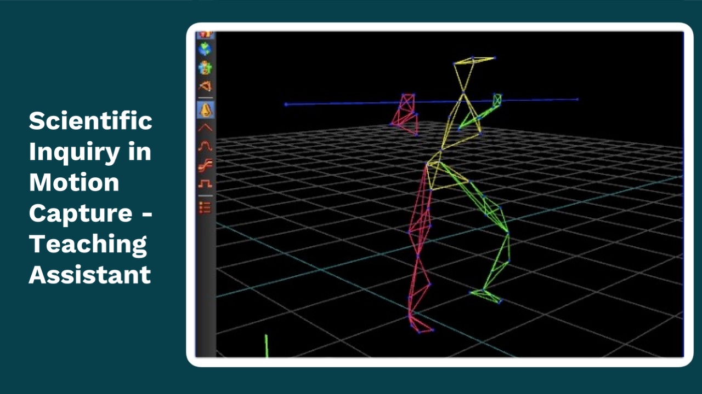
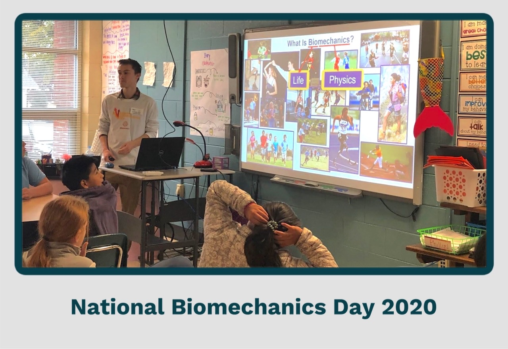
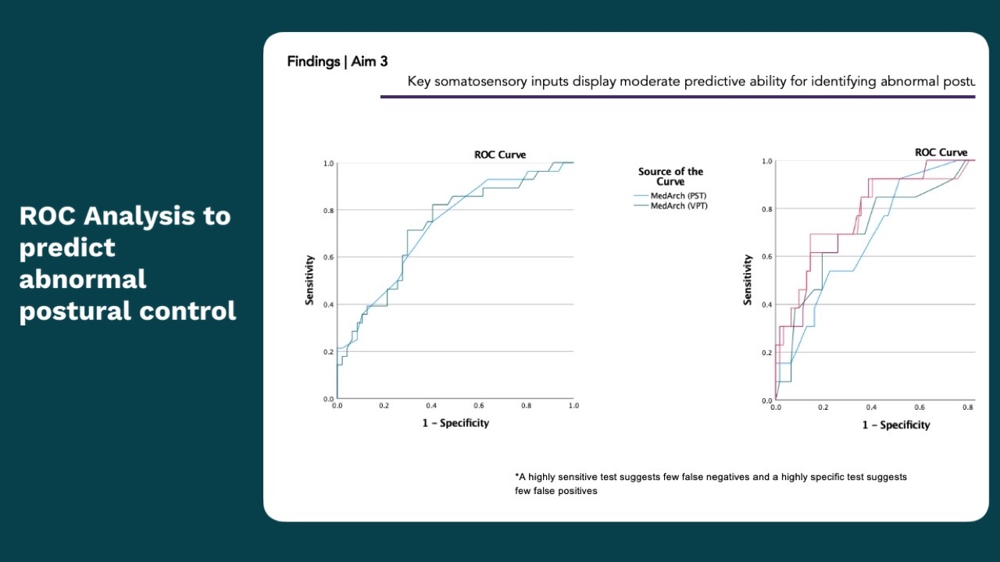
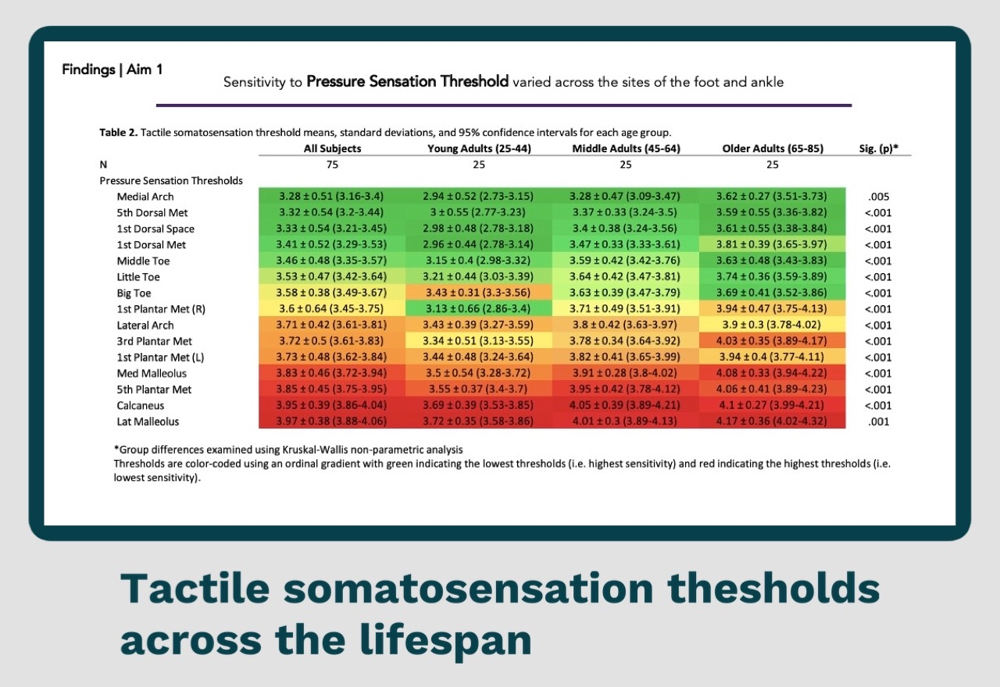
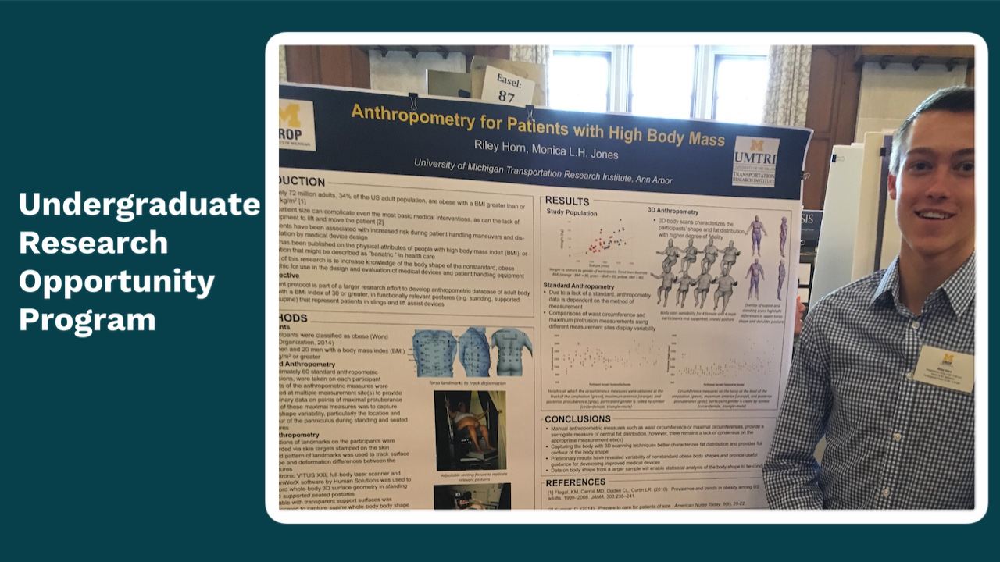

**Hello!** I am a research scientist specializing in kinesiology 
and biomechanics. I am passionate about expanding my research toolbox
by exploring new data collection techniques and research software. 
My interests lie at the exciting intersection of movement science 
and technology, where I am keen to explore opportunities in wearable
devices, biomedical imaging, and physiological signal processing, 
and their applications towards understanding movement disorders and
enhancing human performance.

I have three years of experience managing projects as a 
clinical researcher. As a research associate at the 
Stone Research Foundation, I contribute to orthobiologic 
research with the goal to improve orthopedic surgery techniques 
and outcomes. As a [clinical research assistant](https://rjhorn.github.io/FaSST_project.html)
in the ECU Human Movement and Analysis Lab, I contributed 
to physical therapy research in [fall prevention for 
people with balance disorders](https://rjhorn.github.io/ASB_2020.html).
Check out more of my projects in the slides below.

[//]: # (### Projects)
[//]: # ([ASB 2020 Poster]&#40;/3D_Anthropometry.md&#41;)
[//]: # ()
[//]: # (---)

[//]: # ([]&#40;/404.md&#41;)

[//]: # (### More Projects)

[//]: # ()
[//]: # (- [Project 1 Title]&#40;http://example.com/&#41;)

[//]: # (- [Project 2 Title]&#40;http://example.com/&#41;)

[//]: # (- [Project 3 Title]&#40;http://example.com/&#41;)

[//]: # (- [Project 4 Title]&#40;http://example.com/&#41;)

[//]: # (- [Project 5 Title]&#40;http://example.com/&#41;)

---

[//]: # (---)

[//]: # (
Page template forked from <a href="https://github.com/evanca/quick-portfolio">evanca</a>
)

[//]: # (<!-- Remove above link if you don't want to attibute -->)
