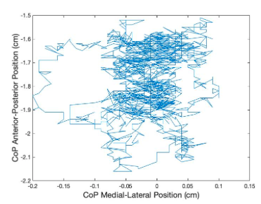
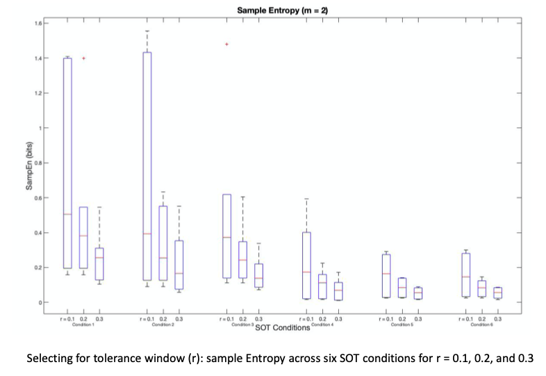
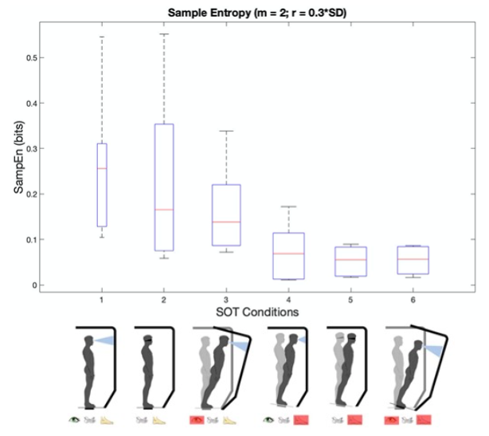

## Nonlinear Analysis of Postural Sway

While working on the [FaSST Project](/FaSST_Project), I investigated center of pressure data from the Sensory Organization test using nonlinear analysis methods. The Sensory Organization Test is a gold standard evaluation of postural control which examines a person’s ability to rely on the somatosensory, visual, or vestibular systems during six balance conditions. The posturography data can be evaluated linearly through metrics such as path length or sway area. Nonlinear analysis investigates the complexity and irregularity of the center of pressure time series. Using Matlab, I calculated sample, approximate, multi-scale entropy of the time-series.

> Example of raw postural sway data.

---

> In this example, I compared different tolerance windows for sample entropy, because entropy values are sensitive to the input parameters. 

---

> Sample entropy analysis of our data revealed lower sample entropy values for more complex sensory balancing tasks. 