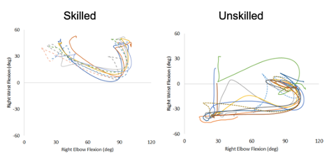
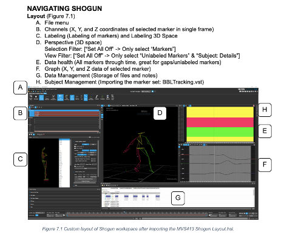

## Scientific Inquiry in Motion Capture

My favorite course in my undergraduate program was an elective called Scientific Inquiry in Motion Capture. The course led students through the scientific method, encouraging us to ask a question to be investigated using 3D Motion Capture technology. My team’s project investigated the effect of footwear on back squat lifting mechanics. We learned Vicon Blade and Visual3D software to clean and analyze our kinematic data. We found that footwear increased peak thorax flexion and that increasing loads altered lifting mechanics. I excelled at learning the motion capture software and I wanted to continue to learn to use software and data collection tools for quantifying complex movement. 

---

For the next two semesters, I was a Teaching Assistant for Dr. Melissa Gross. I wrote guides and led demonstrations to teach the students Vicon Shogun and Visual3D software. I also consulted with the project teams as they developed their experiments and I aided in data collection sessions. Understanding the potential and limitations of 3D Motion Capture was a great experience and I knew I wanted to continue to work with exciting and interesting data exploring scientific questions about human phenomena. 

---

---